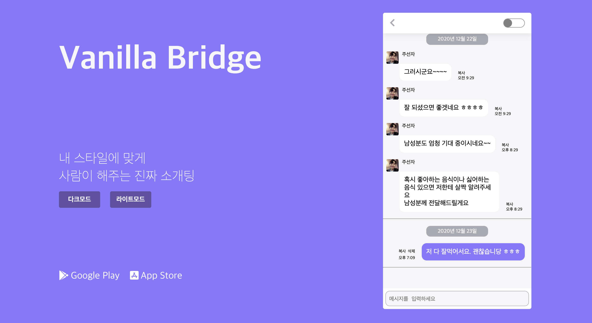
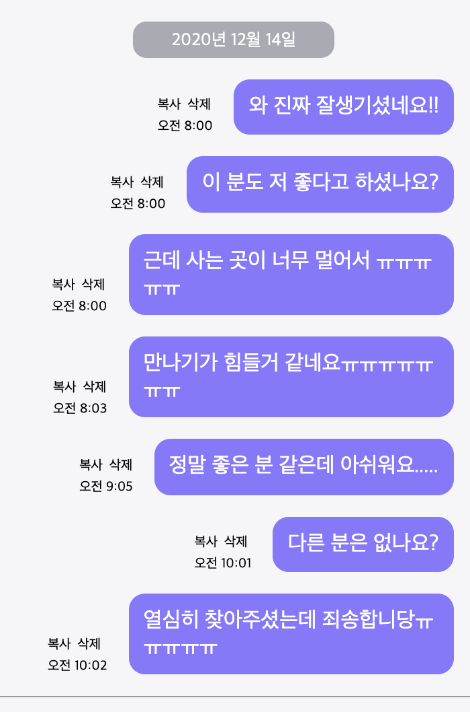
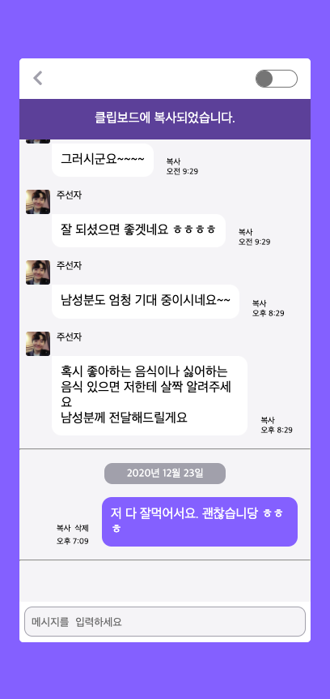
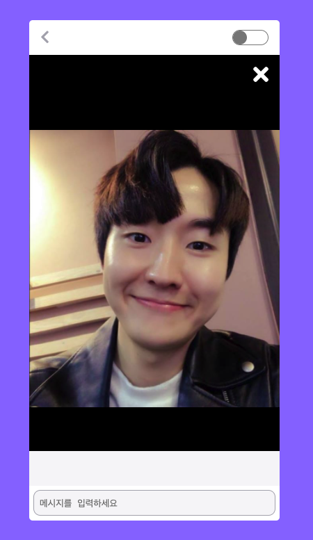
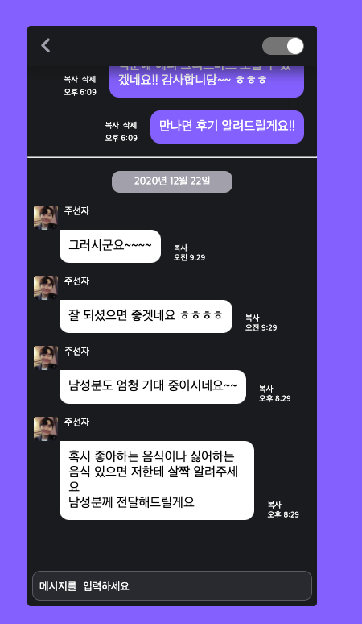

## 실행
```shell script
$ npm intall
$ npm run serve
```

## 구현결과

### 핵심 구현

- 서버에서 가져온 메세지 데이터를 화면에 출력합니다. (서버 api 호출) [ O ]
- 메세지는 created_at(보낸시간) 순으로 정렬되어야 합니다.(created_at 이 같으면 id 순으로 정렬하면 됩니다) [ O ]
- msg.mtype 이 photo 인 메시지는 무시하시면 됩니다. [ O ]
- 메세지 입력창에서 텍스트 입력 후, 보내기 버튼을 누르면 해당 채팅이 화면에 추가됩니다. 메시지 입력한 시간을 보낸 시간으로 기록하면 됩니다.(서버 호출 안해도 됨) [ O ]



### 디자인 (CSS) Requirements

- 채팅방 크기는 360 * 720으로 고정 [ O ]
- 채팅방 background-color: #F6F6F8 [ O ]
- 상대 메시지 background-color: 흰색, 나의 메시지 background-color: #8A74FF [ O ]
- 메시지는 flexbox 형태로 구현 [ O ]
- 메시지가 여러 줄인 경우 박스 크기가 부모를 넘어가는 것을 방지하기 위해 적절한 max-width 값을 할당 [ O ]
- 상대방 메시지 박스의 border-radius는 좌상단=0, 나머지=12px (이미지 참고) [ O ]
- 헤더의 back 아이콘과 전송 버튼의 아이콘은 머터리얼 아이콘을 사용 (chevron_left, arrow_back) [ O ]

### 추가 구현 (optional)

- 채팅방 날짜 구분선 추가 [ O ]
- 프로필 사진 클릭시 확대 사진 팝업 [ O ]
- 메세지 클릭시 클립보드에 복사 [ O ]
- 메세지 입력창에서 엔터키 입력으로도 메세지 전송 [ O ]
- 전송 버튼은 메시지의 length > 0일 때만 보이도록 구현 (like 카톡) [ O ]
- 메시지를 불러와서 화면에 로딩하면 최근 메시지가 보이도록 화면 스크롤 밑으로 내림 [ O ]



### 😀 추추가 구현
- 버튼 조작을 통한 다크모드 추가 구현 [ O ]
- 메시지 삭제 기능 구현 [ O ]


